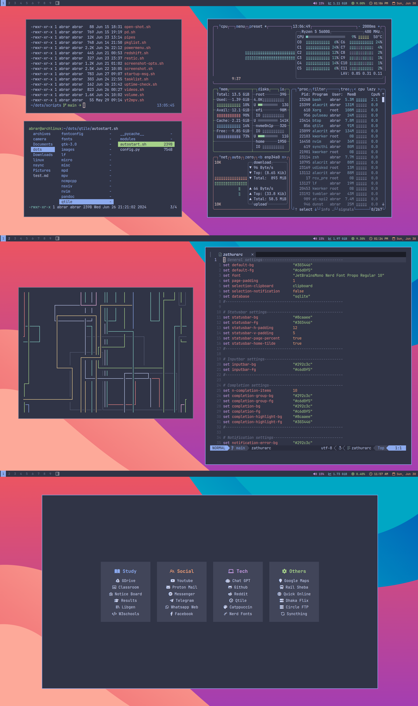
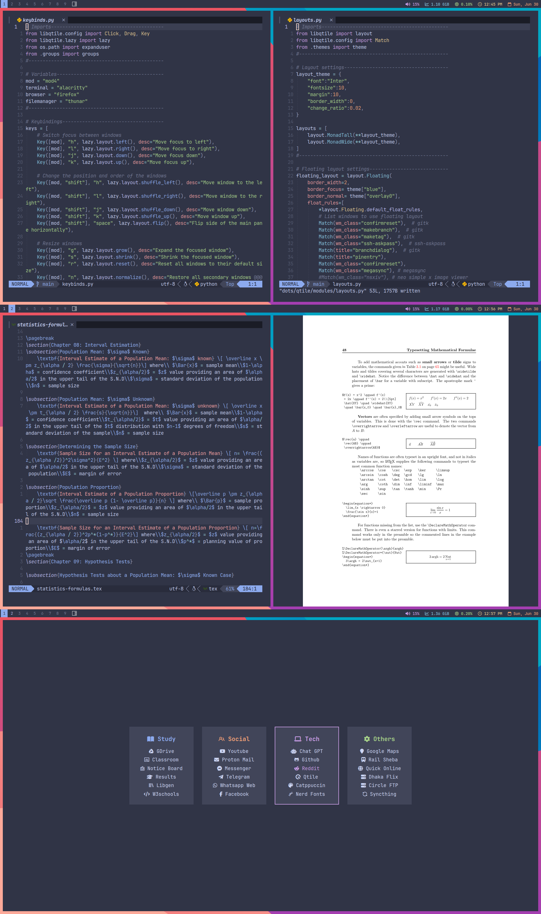
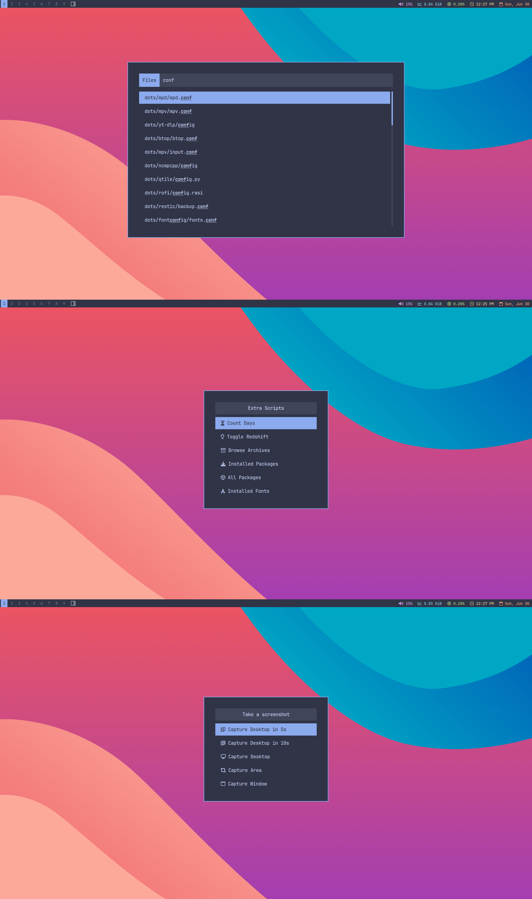

## Introduction
The repository contains dotfiles of my **ArchLinux** machine. I use **ArchLinux** with **Qtile** WM as my daily driver. So, this rice has been done keeping usability and practicality in mind rather than prioritizing only aesthetics.

*In floating layout for aesthetics*

*In MonadTall layout which is practically used*

## Programs
| Type   | Name    |
|--------------- | --------------- |
| Distro | ArchLinux   |
| Window manager | Qtile |
| Bar | Default Qtile bar |
| Colorscheme | Catppuccin Frappe |
| Terminal   | Alacritty   |
| Shell | zsh |
| Browser | Qutebrowser, Firefox |
| Editor   | Neovim, Micro |
| Launcher | Rofi |
| Document viewer | Zathura |
| Media player | mpv |
| Image viewer | nsxiv |
| File Manager | lf, Thunar |
| Audio player | ncmpcpp |
| Backup utility | Restic |
| Notification daemon | Dunst |
| Screenlock | Betterlockscreen |
| System info | btop |
| File converter | Pandoc |
| Nightlight | Redshift |
| Video downloader | yt-dlp |

List of all the packages can be found in `misc/npkglist-*` (native Arch packages) and `misc/fpkglist-*` (foreign/AUR packages).

## Scripts
A good number of *amateurishly* written scripts have been used to increase the ease of use and functionality of the wm. All of the scripts are placed in a single `scripts` folder. Most of them use **Rofi** to display the contents if they have any. 

Screenshots of scripts can be found on `[assets](https://github.com/abrarbinkabir/dots/tree/main/assets) `folder. Here is an example:
 

Below is a list showing where and how the scripts are used:
- `launcher.sh`: show the applications list and currently opened windows menu
- `files.sh`: show all files from folders where you save your documents and open with *default app* on selection
- `folders.sh`: show all folders from parent folders where you save your documents and open with default *file manager* on selection
- `powermenu.sh`: open menu to perform poweroff, logout, restart, suspend and lock
- `volume.sh`: increase, decrease or mute volume
- `screenshot.sh`: take screenshot using various options
- `extras-menu.sh`: menu showing extra scripts which are used occassionally
    - `countdown.sh`: script for countdown events
    - `redshift.sh`: toggle on or off `redshift.service`
    - `archives.sh`: browse and open files in `archives` folder
    - `pkglist.sh`: show all the installed packages
    - `allpkglist.sh`: show all packages available in **ArchLinux** repos
    - `fonts.sh`: show all the installed fonts
    - `kill.sh`: kill a running process from menu
- `archwiki.sh`: seach and open **ArchWiki** articles
- `backup.sh`: take backups of files in USB drive, backup of package list and push the **Git** repo
- `datetime.sh`: show date and time info
- `journal.sh`: open the *journal* for the week, insert today's date and start in *insert* mode
- `tasklist.sh`: open the *tasklist file*, insert `- [ ] ` and start in *insert* mode
- `man.sh`: show a list of *man pages* and open the selected item in **Alacritty**
- `nsxiv.sh`: open all the images in the folder where the selected image is locatedstarting from the selected image
- `open-in-nvim.sh`: show a list of frequently edited folders in a menu and open the selected one in **nvim**
- `open-shot.sh`: open latest screenshot in **nsxiv**
- `pd.sh`: script to convert `md` to `pdf`
- `restic.sh`: used in a `systemd` service file to take **Restic** backup everyday
- `startup-msg`: used in a `systemd` service file to notify about the date today and remind to complete tasks if it's a **Friday** or **first day of the month**

## To-dos
- [ ] add a list of used keybinds
- [ ] add credits section
- [ ] add comments in all scripts
- [ ] add comments in nvim and qutebrowser config

